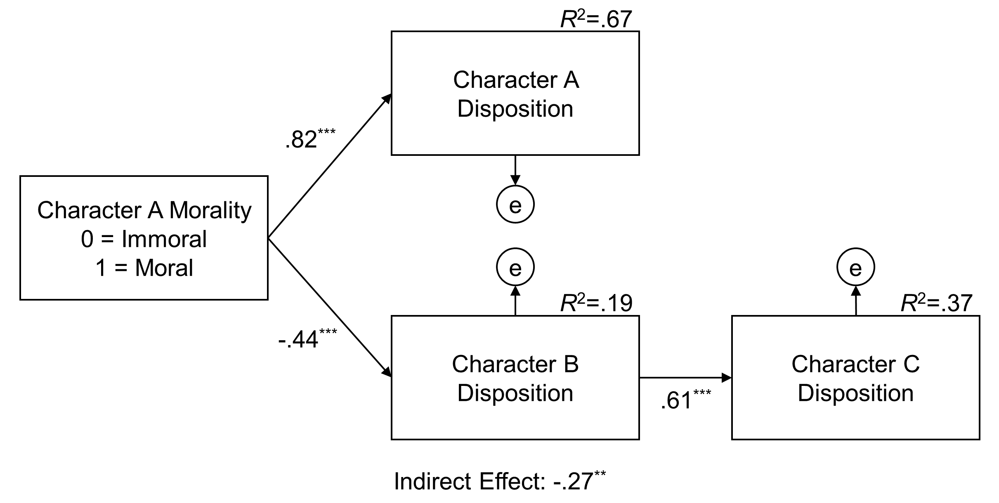

# 🌐 Social Graph Dynamics & Predictive Interaction Modeling

[-blue)](https://academic.oup.com/joc/advance-article/doi/10.1093/joc/jqaf025/8169650)
[-green)](https://github.com/jfrancemone/Social-Graph-Dynamics-and-Predictive-Interaction-Modeling)
[](https://github.com/jfrancemone/Social-Graph-Dynamics-and-Predictive-Interaction-Modeling)

### **Project Overview**

How do relationships bias user perception? This experimental research demonstrates how network structure shapes attitude formation — a core principle underlying social recommendation systems. Across three studies (N = 725), I tested Heider's Balance Theory to quantify when users assimilate attitudes from liked connections versus contrast against disliked ones.

While conducted in a controlled experimental context, the findings translate directly to understanding when "friend-of-a-friend" recommendations succeed versus backfire. The research identifies specific network configurations that predict user sentiment, offering a psychological foundation for graph-based recommendation logic.

> **📄 Publication:**
> Francemone, C. J., & Grizzard, M. (2025). Evidence of balance theory as a predictive framework for character interdependence. *Journal of Communication.*
> 
> [**Read the Full Paper (PDF)**](Francemone_Balance_Theory_2025.pdf)

*Note: This project uses SPSS and AMOS for statistical modeling. The experimental design and analytical approach are tool-agnostic and transferable to Python-based workflows.*

---

### **Key Findings & Strategic Insights**

#### **1. Network Context Predicts Sentiment**
Content is not judged in a vacuum.
* **The Finding:** A user's evaluation of a target is significantly biased by their relationship with the *introducer* (the intermediary node).
* **The Mechanism:** **Assimilation** (liking what your connections like) and **Contrast** (disliking what your enemies like) accounted for variance in sentiment even when the target's actual behavior was ambiguous.
* **Implication for Recommendation Systems:** The source of the recommendation (e.g., liked by friend) may be as predictive of engagement as the content itself.

#### **2. The "Enemy of My Enemy" Effect**
* **The Finding:** Negative relationships in a network are highly predictive. Users consistently formed positive perceptions of targets who were antagonistic toward a shared "enemy."
* **Strategic Insight:** Systems that only optimize for positive connections may miss valid relationship opportunities driven by shared out-groups or competitive dynamics.

#### **3. When Recommendations Backfire**
* **The Finding:** Introducing a user to a target via a negative-valenced node (a disliked intermediary) consistently resulted in *lower* affinity than no introduction at all.
* **Implication for Trust & Safety:** Recommendations that traverse through blocked, muted, or negatively-rated nodes risk amplifying negative sentiment rather than building connection.



---

### **Methodology**

* **Design:** Multi-Study Experimental Series testing triadic balance configurations.
* **Participants:** N = 725 across 3 studies (Study 1 = 162, Study 2 = 351, Study 3 = 212).
* **Framework:** **Heider’s Balance Theory** (P-O-X Triads) -- a foundational model for how relationships create pressure toward attitudinal consistency.
* **Analysis:**
    * **Factorial ANOVA:** To test main effects of relationship valence on target evaluation.
    * **Path Analysis (SEM):** To quantify the magnitude of assimilation and contrast effects via mediation models.
* **Tools:**
    * **SPSS:** Primary statistical modeling.
    * **AMOS:** Structural equation modeling for mediation analysis.

---

### **Repository Structure**

```text
/Social-Graph-Dynamics-and-Predictive-Interaction
│
├── /Study 1                                      <-- Initial Investigation (Triadic Balance)
│   ├── Path_Model.amw                            <-- Mediation analysis of network balance
│   ├── [A/B/C]_Disposition.amw                   <-- Measurement validity for network nodes
│   ├── Study_1_Data.sav                          <-- Original dataset
│   ├── Study_1_Data.csv                          <-- Converted dataset
│   ├── Study_1_Output.csv                        <-- Factorial ANOVAs and main effects
│   └── Study_1_Syntax.sps                        <-- Syntax for ANOVAs and main effects
│
├── /Study 2                                      <-- High-Powered Replication (Robustness Check)
│   └── (Contains identical data/model artifacts to Study 1)
│
├── /Study 3                                      <-- Randomized Measurement Replication
│   └── (Contains identical data/model artifacts to Study 1)
│
└── Francemone_Balance_Theory_2025.pdf            <-- Full published manuscript
```

---

### **My Role**
**Lead Quantitative Researcher**
* Designed and executed the experimental framework testing balance theory predictions across network configurations.
* Built the structural equation models (AMOS) to quantify assimilation and contrast effects in user sentiment.
* Managed data collection and replication across three studies (N = 725) to ensure result robustness.
* First author on the peer-reviewed publication in *Journal of Communication.*
